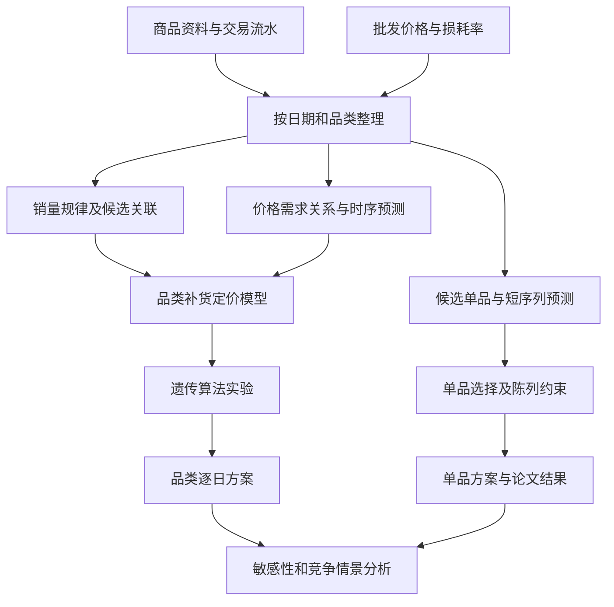

# 蔬菜类商品的自动定价与补货决策

**2023 年高教社杯全国大学生数学建模竞赛 C 题 · 浙江省一等奖**  
团队论文：《基于互补替代关系的补货定价策略》  
蒋恩晶｜队长、建模手

[阅读论文](report/2023-CUMCM-C-report.pdf) · [实验代码](code/) · [官方赛题与数据](https://www.mcm.edu.cn/html_cn/node/c74d72127066f510a5723a94b5323a26.html)

## 项目简介

生鲜蔬菜保鲜期短，采购价格与需求持续波动。商超每天不仅要判断“明天能卖多少”，还要同时决定“补哪些菜、各补多少、卖什么价格”：补货过多增加损耗，补货不足影响销售，提价又可能降低需求。

本项目基于近三年商超销售、商品分类、批发价格与损耗数据，串联**销售规律分析 → 销量与成本预测 → 品类补货定价 → 单品选配 → 敏感性与竞争情景分析**。研究重点是将数据分析转化为带有损耗、陈列与选品限制的经营决策，而非仅完成销量预测。

> 仓库收录团队竞赛论文与原始 Python 实验脚本，属于研究成果归档。目前不是交互式网页 Demo，也未完成一键复现；论文方案与代码实现范围见文末说明。

## 如何读完这个项目

| 阅读目标 | 推荐顺序 | 读完应能回答 |
| --- | --- | --- |
| 快速理解竞赛成果 | 第 01、03、05、08 节 | 四个赛题问题怎样连接，团队做出了什么 |
| 理解技术取舍 | 第 02、04、09 节 | 数据、预测、需求函数和利润目标如何衔接 |
| 准备复现 | 第 06、07 节 | 先补哪些数据，哪些脚本需要先校验 |

**业务主线：** 门店在决策时点拥有历史销售、进价与损耗信息，需要输出未来日期的商品补货量和售价，而不是只输出一列预测销量。数据分析识别规律，预测估计未来输入，优化在约束下形成方案，最终再用经营指标评价。对应的读者包括建模学习者、预测研究者，以及希望理解采购决策的业务人员。

**建议做的第一份笔记：** 从论文中选一个品类，把“历史数据截止日、预测日期、价格单位、补货单位、损耗率、需求假设、利润计算”列在同一张表上，再追踪对应脚本。若任何一项缺失，先标记待核实，不要通过猜测补齐。这能更快定位“算法跑完但业务含义不对”的问题。

## 01｜赛题要求与本队方案

| 问题 | 赛题要求 | 本队方法与输出 |
| --- | --- | --- |
| 一：销售规律 | 分析蔬菜品类及单品销量分布与相互关系 | 描述性统计、Spearman 相关、灰色关联分析，形成销量规律与候选关联关系 |
| 二：品类决策 | 分析销量与成本加成定价关系，制定 2023 年 7 月 1—7 日各品类日补货量和定价策略，使收益最大 | ARIMA 预测、价格—需求拟合、考虑损耗的非线性优化与遗传算法，输出六大品类逐日方案 |
| 三：单品决策 | 依据 6 月 24—30 日可售商品，在 27—33 个单品、每个选中单品至少陈列 2.5 kg 等条件下制定 7 月 1 日方案，并尽量满足品类需求 | GM(1,1) 小样本预测；论文提出包含选择变量、补货量与需求惩罚的优化模型，给出选品、补货与定价结果 |
| 四：数据扩展 | 说明还需采集哪些数据，以及如何支持决策 | 分析线上竞品价格、供应链成本、消费者反馈等数据的作用，进行竞争价格情景分析 |

## 02｜数据基础

赛题数据覆盖 **2020 年 7 月 1 日至 2023 年 6 月 30 日**，包含花叶类、花菜类、水生根茎类、茄类、辣椒类、食用菌六大品类。

| 数据 | 信息 | 用途 |
| --- | --- | --- |
| 商品资料 | 单品编码、名称、分类 | 关联交易与品类，确定分析粒度 |
| 销售流水 | 日期、销量、销售单价、折扣等 | 汇总日销量，分析价格与需求关系 |
| 批发价格 | 单品每日进价 | 预测采购成本，为决策提供输入 |
| 损耗率 | 商品损耗信息 | 连接采购数量、可售数量与收益 |

预处理包括多表关联、日期与品类聚合、缺失日期检查、异常记录筛查和折扣销售处理。论文还使用 Minitab、SPSS 完成部分统计分析，公开 Python 脚本未覆盖全部分析步骤。

## 03｜建模路线

### 销量关联：为组合决策提供线索

从品类与单品两个层级观察销量分布和时间变化，利用 Spearman 相关、灰色关联分析筛选候选关系。相关性用于辅助需求分析，不直接证明因果意义上的互补或替代；季节、促销及共同客流也可能产生相关性。

### 品类补货定价：让预测服务于收益目标

1. 分析销量、销售价格和进价，拟合价格—需求关系。
2. 利用 ARIMA 进行时序建模，形成未来一周决策输入。
3. 将采购成本、损耗与需求关系纳入优化目标，使用遗传算法搜索补货方案并计算相应价格。
4. 对批发价进行 ±5% 扰动，检查策略敏感性。

遗传算法是启发式搜索，迭代趋稳不等于证明全局最优。

### 单品选配：从六大品类细化到具体商品

论文针对 49 个候选单品开展分析，采用 GM(1,1) 处理短序列预测，提出联合选品、补货与定价的非线性混合整数建模方案。

用 `y_i ∈ {0,1}` 表示是否选择单品，`q_i` 表示补货量，关键约束可概括为：

- `27 ≤ Σ y_i ≤ 33`：控制单品数量；
- `q_i ≥ 2.5 × y_i`：选中单品满足最小陈列量；
- `q_i ≤ M_i × y_i`：未选中单品不补货，`M_i` 为合理上限；
- 收益目标同时考虑损耗与品类需求满足程度。

以上是便于阅读的约束概括，完整公式与假设以论文为准。当前单品脚本是连续变量遗传算法实验，尚未完整实现上述选品约束。

### 竞争情景：纳入线上渠道价格信息

第四问引入美团、叮咚等线上渠道价格信息，讨论竞争加价水平对补货与定价的影响，并提出进一步采集供应链成本和消费者反馈等数据。该部分是情景分析，不是已验证的市场因果效果；仓库未提供独立第四问脚本与完整外部价格表。

## 04｜从数据到决策的完整架构



这张图展示论文的研究逻辑，不代表四个 Python 文件已经组成自动运行的流水线。原实验包含手工中间表、外部统计软件和硬编码参数，复现时需要恢复它们之间的数据接口。

### 预测与优化的职责不同

预测回答“未来需求或成本大约是多少”；优化回答“在需求、价格和约束的共同作用下，应该如何决策”。一个预测误差更低的模型，不一定对应利润更高的补货策略，因为缺货、损耗、价格弹性和陈列约束会放大不同方向的误差。

因此，完整评价应同时检查预测误差、决策可行性与收益情景，不能只用 ARIMA 的拟合曲线证明经营方案有效。

### 用简化形式理解目标函数

为了说明变量关系，可用下式表示单品的经营机制：

$$s_i\le D_i(p_i),\quad s_i\le (1-\ell_i)q_i,\qquad
\max\sum_i\left(p_i s_i-c_i q_i\right).$$

其中 `q_i` 为采购量，`p_i` 为售价，`c_i` 为单位采购成本，`ℓ_i` 为损耗比例，`s_i` 为售出量，`D_i(p_i)` 为价格对应的需求。这个式子是解释性示意，不替换原论文的需求拟合、成本设置与惩罚函数，也不是当前脚本已经实现的新模型。

它说明了三个基本关系：补得多不等于卖得多；售价变化会影响需求；收益要扣除全部采购成本，而不是只统计售出部分的成本。

### 为什么选择这些方法？

| 方法 | 适合回答的子问题 | 本项目中需要注意的条件 |
| --- | --- | --- |
| Spearman | 销量变量之间的单调关联 | 共同季节性可能造成相关，不等于互补替代因果效应 |
| 灰色关联 | 不同序列变化形态的接近程度 | 预处理和无量纲化会影响结果 |
| ARIMA | 利用序列自相关进行短期预测 | 差分、平稳性、残差和时间切分都需核验 |
| GM(1,1) | 短序列的趋势外推 | 小样本也会失真；拟合值不能当作下一期预测 |
| 遗传算法 | 搜索非线性目标中的候选决策 | 可行域、罚函数与遗传算子边界必须一致 |
| 敏感性分析 | 检查成本变化时策略是否稳定 | 只扫描进价不等于已经覆盖全部需求不确定性 |

## 05｜论文结果示例

**2023 年 7 月 1 日品类方案**，摘录自论文表 6，未在此次文档整理中重新计算：

| 品类 | 补货量（kg） | 定价（元/kg） |
| --- | ---: | ---: |
| 水生根茎类 | 25.47 | 6.077 |
| 花叶类 | 149.03 | 5.050 |
| 花菜类 | 22.42 | 11.636 |
| 茄类 | 21.89 | 5.608 |
| 辣椒类 | 80.29 | 7.895 |
| 食用菌 | 48.15 | 14.927 |

- **品类结果**：论文给出 7 月 1—7 日逐日方案；问题二示例收敛曲线约在 160 代后趋稳。
- **单品结果**：论文报告从 49 个候选单品中选择 33 个，补货与价格见表 8。
- **情景分析**：比较进价扰动及线上竞争条件变化下的策略。

这些是基于赛题数据与模型假设的竞赛方案，不代表商超实际执行效果。项目不声称已实现某一比例的利润提升，也不把拟合优度等同于样本外预测表现。

## 06｜文件与阅读顺序

| 文件 | 内容 |
| --- | --- |
| [团队论文](report/2023-CUMCM-C-report.pdf) | 完整问题分析、数学模型、结果与讨论；建议先读摘要和结果表 |
| [question1.py](code/question1.py) | 多表关联、预处理、日期汇总与相关分析 |
| [question2.py](code/question2.py) | 价格—需求拟合、平稳性检验、ARIMA 实验 |
| [question2_GA.py](code/question2_GA.py) | 品类级遗传算法实验 |
| [question3.py](code/question3.py) | GM(1,1) 与单品连续变量遗传算法实验 |

主要工具：Python、Pandas、NumPy、SciPy、statsmodels、Matplotlib、Seaborn、DEAP；部分统计分析使用 Minitab、SPSS。

## 07｜复现说明与实现边界

脚本保留竞赛阶段的实验形式，依赖手工中间表与硬编码参数。仓库尚未包含原始附件、完整中间表及锁定依赖版本，不能保证克隆后直接运行或重现全部论文数值。

建议复现顺序：获取官方 C 题附件 → 核对脚本读取路径、字段与编码 → 准备中间表 → 校验模型实现 → 分问题运行 → 固定随机种子、记录环境并比对论文结果。

当前已识别、尚待校验或补齐的部分：

| 环节 | 实现边界 |
| --- | --- |
| 清洗 | 阈值与注释不完全一致；筛选后重置索引再删除的逻辑需校验 |
| ARIMA | 手工差分与模型差分参数衔接存在重复差分风险 |
| 品类优化 | 需求函数与拟合脚本的表达、变异范围与业务边界需统一 |
| 单品优化 | 需补齐 0-1 选择变量、数量及陈列约束；区分灰色模型样本内拟合值与下一期预测值 |

本次只整理项目说明，未修改竞赛原始代码，也未宣称以上问题已经修复。

### 复现前先做哪些检查？

1. **数据覆盖检查**：日期范围、商品编码、品类标签是否与赛题一致。
2. **字段与单位检查**：销量是否以 kg 计，价格是否为元/kg，损耗是否误把百分数当小数。
3. **时间边界检查**：为 7 月 1 日决策时，不应使用 7 月 1 日之后的真实信息。
4. **约束检查**：选中单品数量、陈列量、非负价格和补货量是否满足要求。
5. **随机性检查**：保存随机种子，重复运行遗传算法，不以单次最好结果代表稳定表现。
6. **财务检查**：收益和成本计算口径一致，销量不能无限超过可售库存。

### 如何定位代码中的断点？

| 脚本 | 先读哪里 | 重点核查 |
| --- | --- | --- |
| `question1.py` | 输入表读取和关联 | 商品编码是否保留、删除异常行时索引是否一致 |
| `question2.py` | 差分与模型构造 | 手工差分和 ARIMA 的 d 是否重复、预测结果如何还原 |
| `question2_GA.py` | 目标函数和可行域 | 初始化 qmin/qmax 与交叉/变异的范围是否冲突 |
| `question3.py` | GM 预测与连续变量 GA | 是否输出真正下一期预测，是否落实离散选品约束 |

品类 GA 中可看到初始化使用各品类的 `qmin/qmax`，而交叉和变异算子写了统一的 1—10 范围；这不是可以忽略的文档差异，会影响可行解和目标解释。读者应先修复并测试，再比较论文结果。本次不改原始脚本，以保持竞赛材料可追溯。

### 最小复现环境如何准备？

建议建立隔离环境，按实际使用的脚本安装 Pandas、NumPy、SciPy、statsmodels、Matplotlib、Seaborn、DEAP，以及相应表格读取依赖。仓库没有锁定的完整依赖清单，不把当前最新版组合声称为论文原环境。

```bash
git clone https://github.com/jiangenjing/cumcm-2023-c-vegetable-replenishment.git
cd cumcm-2023-c-vegetable-replenishment
python3 -m venv .venv
```

下一步是恢复数据路径和中间表，而不是直接运行四个脚本并期待成功。完成一次可重复运行后，再固化依赖版本与执行顺序。

### 建议补做的验证实验

- 与“沿用最近一天销量”“同星期均值”等简单预测基线比较，检验复杂方法是否确有收益。
- 在多个历史截点滚动回测，把预测结果输入同一优化模型，观察收益与损耗。
- 对需求、进价、损耗同时做情景分析，检查方案的脆弱性。
- 使用独立约束检查器验证 GA 输出，不只读取适应度数值。

以上为进一步整理和复现的路线，不作为已完成实验或已获得改进率展示。

## 08｜个人角色

我在团队中担任队长、建模手，围绕数据分析、预测和补货定价优化推进建模工作。本仓库呈现团队共同完成的竞赛成果，不将全部论文或脚本归为个人独立产出。

项目训练了三项能力：将经营问题拆解为数据与约束；连接统计分析、时序预测与优化决策；区分相关关系、模型预测与真实经营收益。

## 09｜技术补充：如何把预测误差转成经营解释？

对蔬菜补货，需求高估可能增加损耗，低估可能造成缺货，两种误差的损失通常不对称。回测除了 MAE 或 RMSE，还应记录浪费、未满足需求和利润情景。需要明确“实际销售量”可能因断货低于真实需求；直接把低销量当成低需求，会让预测和补货一起持续偏低。

ARIMA 的 `order=(p,d,q)` 分别涉及自回归、差分与移动平均部分；它不自动学习所有价格、节假日与促销影响。若显式加入外生变量，还需保证预测期这些变量确实可获得。参见 [statsmodels ARIMA 官方接口](https://www.statsmodels.org/stable/generated/statsmodels.tsa.arima.model.ARIMA.html)。原代码是否进行了手工差分、模型内部又用了何种 d，应在运行前核对。

建议把回测按每日经营过程展开：在某天结束时，仅使用此前信息预测下一天需求与成本，生成价格和补货方案，再用下一天数据评估；连续滚动多个截点。这样可以观察节假日、周末和不同进价阶段的稳定性，而不是只挑一次结果最好的一周。

最终的管理建议也需要可执行：给采购人员的输出应包含商品、日期、单位、采购量、售价、假设进价与风险提示，而不是只给出算法适应度。若进价超出预设区间，应明确需要重算或人工复核，避免将一次竞赛方案长期机械执行。

## 资料来源

- [竞赛官网：2023 年赛题与附件](https://www.mcm.edu.cn/html_cn/node/c74d72127066f510a5723a94b5323a26.html)
- [本队论文：《基于互补替代关系的补货定价策略》](report/2023-CUMCM-C-report.pdf)

赛题与数据权益归原发布方所有。本仓库用于研究展示与学习交流，不代表竞赛官方解答。
